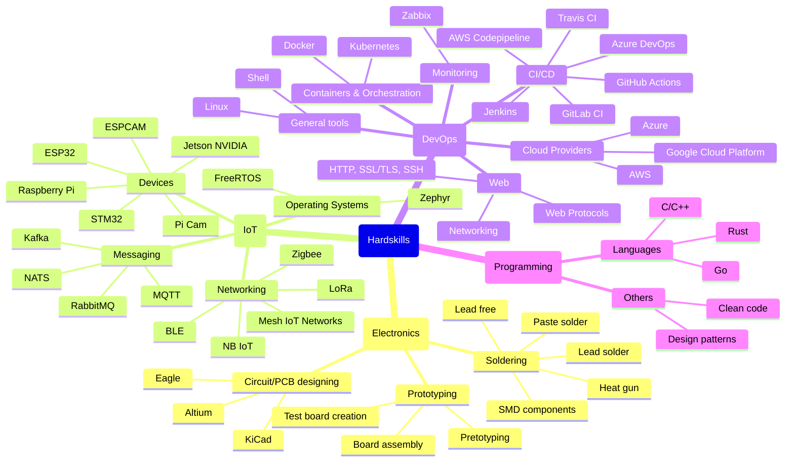
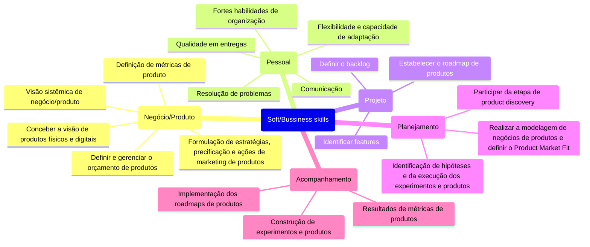

# pdi

Para ver em lista simples:
```bash
sed '/:/d; /mindmap/d; s/  / /g' *.mmd | sed 's/[()]//g'; echo;
```

## hardskills

```mermaid
mindmap
  (Hardskills)
  ::icon(fa fa-laptop)
    (Electronics)
    ::icon(fa fa-microchip)
        Circuit/PCB designing
            Altium
            Eagle
            KiCad
        Prototyping
            Board assembly
            Test board creation
            Pretotyping
        Soldering
            Lead solder
            Lead free
            Heat gun
            SMD components
            Paste solder
    (IoT)
    ::icon(fa fa-cloud)
        Devices
            Raspberry Pi
            Pi Cam
            ESPCAM
            ESP32
            STM32
            Jetson NVIDIA
        Networking
            LoRa
            Zigbee
            BLE
            Mesh IoT Networks
            NB IoT
        Messaging
            MQTT
            RabbitMQ
            Kafka
            NATS
        Operating Systems
            FreeRTOS
            Zephyr
    (DevOps)
    ::icon(fa fa-infinity)
        General tools
            Linux
            Shell
        Web
            Networking
            Web Protocols
            HTTP, SSL/TLS, SSH
        Containers & Orchestration
            Docker
            Kubernetes
        Cloud Providers
            AWS
            Azure
            Google Cloud Platform
        CI/CD
            Jenkins
            GitLab CI
            GitHub Actions
            Travis CI
            AWS Codepipeline
            Azure DevOps
        Monitoring
            Zabbix
    (Programming)
    ::icon(fa fa-book)
        Languages
            C/C++
            Rust
            Go
        Others
            Clean code
            Design patterns
    
```

## softskills

```mermaid
mindmap
    (Soft/Bussiness skills)
    ::icon(fa fa-users)
        (Negócio/Produto)
        ::icon(fa fa-suitcase)
            Visão sistêmica de negócio/produto
            Conceber a visão de produtos físicos e digitais
            Definir e gerenciar o orçamento de produtos
            Definição de métricas de produto
            Formulação de estratégias, precificação e ações de marketing de produtos
        (Pessoal)
        ::icon(fa fa-user)
            Resolução de problemas
            Flexibilidade e capacidade de adaptação
            Comunicação
            Fortes habilidades de organização
            Qualidade em entregas
        (Projeto)
        ::icon(fa fa-search)
            Definir o backlog
            Identificar features
            Estabelecer o roadmap de produtos
        (Planejamento)
        ::icon(fa fa-edit)
            Participar da etapa de product discovery
            Identificação de hipóteses e da execução dos experimentos e produtos
            Realizar a modelagem de negócios de produtos e definir o Product Market Fit
        (Acompanhamento)
        ::icon(fa fa-sticky-note)
            Construção de experimentos e produtos
            Implementação dos roadmaps de produtos
            Resultados de métricas de produtos

```
