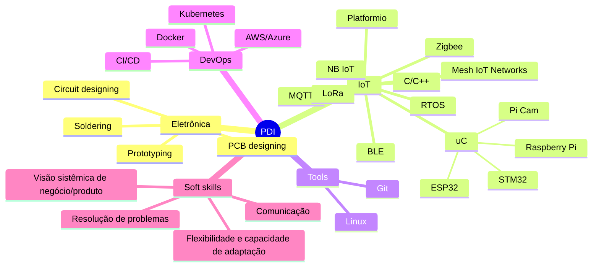

# pdi

```mermaid
mindmap
  root((PDI))
    Eletrônica
    ::icon(fa fa-user)
        Circuit designing
        PCB designing
        Prototyping
        Soldering
    IoT
        uC
            Raspberry Pi
            Pi Cam
            ESP32
            STM32
        C/C++
        RTOS
        MQTT
        LoRa
        Zigbee
        BLE
        Mesh IoT Networks
        Platformio
        NB IoT
    Tools
        Linux
        Git
    DevOps
        Docker
        Kubernetes
        AWS/Azure
        CI/CD
    Soft skills
        Comunicação
        Visão sistêmica de negócio/produto
        Flexibilidade e capacidade de adaptação
        Resolução de problemas
    

```
